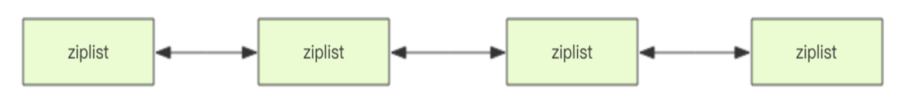

# List\(列表\)

Redis 的列表相当于 Java 语言里面的 LinkedList，注意它是链表而不是数组。这意味着 list 的插入和删除操作非常快，时间复杂度为 O\(1\)，但是索引定位很慢，时间复杂度为 O\(n\)。当列表弹出了最后一个元素之后，该数据结构自动被删除，内存被回收。Redis 的列表结构常用来做异步队列使用。

## 右边进左边出：队列 

```text
> rpush books python java golang
(integer) 3
> llen books
(integer) 3
> lpop books
"python"
> lpop books
"java"
> lpop books
"golang"
> lpop books
(nil)
```

## 右边进右边出：栈 

```text
> rpush books python java golang
(integer) 3
> rpop books
"golang"
> rpop books
"java"
> rpop books
"python"
> rpop books
```

## 慢操作

* lindex 相当于 Java 链表的get\(int index\)方法，它需要对链表进行遍历，性能随着参数index增大而变差。 
* ltrim 跟的两个参数start\_index和end\_index定义了一个区间，在这个区间内的值，ltrim 要保留，区间之外统统移除。
* index 可以为负数，index=-1表示倒数第一个元素，同样index=-2表示倒数第二个元素。

```text
> rpush books python java golang
(integer) 3
> lindex books 1 # O(n) 慎用
"java"
> lrange books 0 -1 # 获取所有元素，O(n) 慎用
1) "python"
2) "java"
3) "golang"
> ltrim books 1 -1 # O(n) 慎用
OK
> lrange books 0 -1
1) "java"
2) "golang"
> ltrim books 1 0 # 这其实是清空了整个列表，因为区间范围长度为负
OK
> llen books
(integer) 0
```

## 快速列表



Redis 底层存储的还不是一个简单的 linkedlist，而是称之为快速链表 quicklist 的一个结构。 

* 在列表元素较少的情况下会使用一块连续的内存存储，这个结构是 ziplist，也即是压缩列表。它将所有的元素紧挨着一起存储，分配的是一块连续的内存。
* 当数据量比较多的时候才会改成 quicklist，

