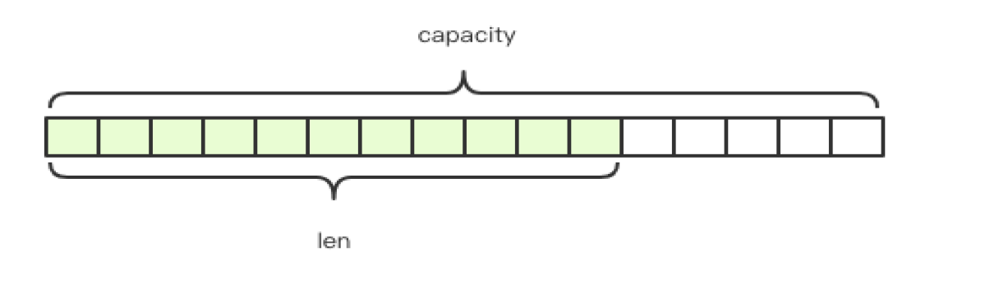

# String\(字符串\)

## 动态字符串

Redis 的字符串是动态字符串，是可以修改的字符串，内部结构实现上类似于 Java 的 ArrayList，采用预分配冗余空间的方式来减少内存的频繁分配，如图中所示，内部为当前字符串实际分配的空间 capacity 一般要高于实际字符串长度 len。当字符串长度小于 1M 时，扩容都是加倍现有的空间，如果超过 1M，扩容时一次只会多扩 1M 的空间。



字符串的最大长度为512M。

## 语法

```text
> set name codehole
OK
> get name
"codehole"
> exists name
(integer) 1
> del name
(integer) 1
> get name
(nil)
```

## 过期

对key设置过期时间，到点后会自动删除

```text
> setex name 5 codehole # 5s 后过期，等价于 set+expire
> setnx name codehole # 如果 name 不存在就执行 set 创建
```

## 计数

如果 value 值是一个整数，还可以对它进行自增操作。自增是有范围的，它的范围是 signed long 的最大最小值。

```text
> set age 30
OK
> incr age
(integer) 31
> incrby age 5
(integer) 36
> incrby age -5
(integer) 31
```

