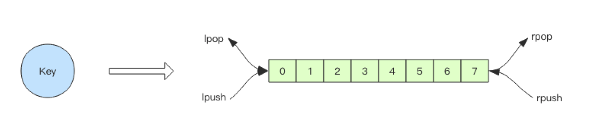

# 延时队列

Redis 的消息队列不是专业的消息队列，它没有非常多的高级特性，没有 ack 保证，如果对消息的可靠性有着极致的追求，那么它就不适合使用。 

## 异步消息队列

Redis 的 list\(列表\) 数据结构常用来作为异步消息队列使用，使用rpush/lpush操作入队列，使用lpop 和 rpop来出队列。 



```text
> rpush notify-queue apple banana pear
(integer) 3
> llen notify-queue
(integer) 3
> lpop notify-queue
"apple"
> llen notify-queue
(integer) 2
> lpop notify-queue
"banana"
> llen notify-queue
(integer) 1
> lpop notify-queue
"pear"
> llen notify-queue
(integer) 0
> lpop notify-queue
(nil)
```

## 队列为空处理

客户端是通过队列的 pop 操作来获取消息，然后进行处理。处理完了再接着获取消息，再进行处理。如此循环往复，这便是作为队列消费者的客户端的生命周期。 

可是如果队列空了，客户端就会陷入 pop 的死循环，不停地 pop，没有数据，接着再 pop，又没有数据。这就是浪费生命的空轮询。空轮询不但拉高了客户端的 CPU，redis 的 QPS 也会被拉高，如果这样空轮询的客户端有几十来个，Redis 的慢查询可能会显著增多。 

通常我们使用 sleep 来解决这个问题，让线程睡一会，睡个 1s 钟就可以了。不但客户端的 CPU 能降下来，Redis 的 QPS 也降下来了。 

## 队列延迟

用上面睡眠的办法可以解决问题。但是有个小问题，那就是睡眠会导致消息的延迟增大。

redis提供blpop、brpop阻塞式的命令，当阻塞队列中没有数据时，会立即进入休眠状态，一旦有数据时，则立刻醒过来

但使用上述命令时，如果线程一直阻塞在哪里，Redis 的客户端连接就成了闲置连接，闲置过久，服务器一般会主动断开连接，减少闲置资源占用。这个时候blpop/brpop会抛出异常来。 因此客户端需要注意捕获异常


